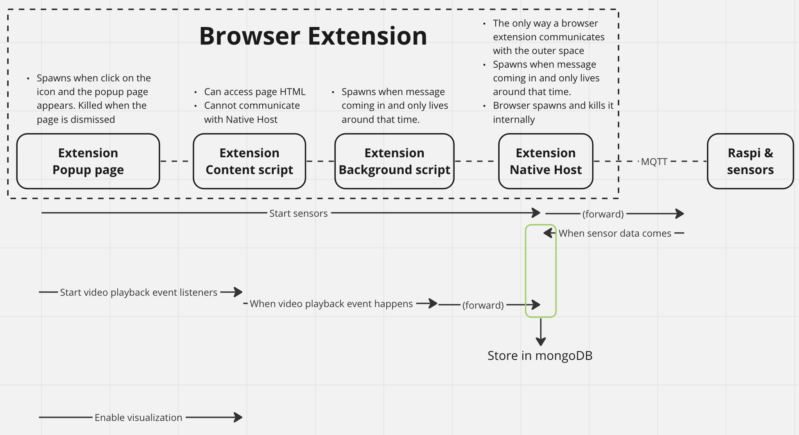
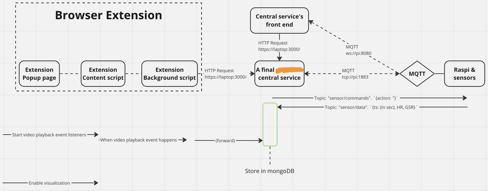

# Sharing Frissons among Online Video Viewers

This is the project codebase of our academic paper *Sharing Frissons among Online Video Viewers: Exploring the Design of Affective Communication for Aesthetic Chills*. The paper is (will be) available [here](https://doi.org/10.1145/3613904.3642818) at DOI `10.1145/3613904.3642818` after CHI'24 (The ACM CHI conference on Human Factors in Computing Systems) on May 11–16, 2024.

To cite the paper:

```
TBA after published.
```

### Setup and Run

- Use Chromium-based browsers.
- Install Node.js dependencies (e.g., `npm install`) at the root folder.
- Install the Chrome extension at folder `browser-extension`.
- Connect the computer and the Raspberry Pi to the same LAN.
- Copy the `sensors` folder to Raspberry Pi.
- Run `sensors/main.py` on Raspberry Pi.
- Run `service/server/main.js` on the computer.
- Open `service/client/index.html` on the computer.
- Open one of the four sample videos (links in the paper).
- To run the sensors, use the `service/client/index.html` control panel website.
- To run the feedback, click the browser extension icon and use the popup control panel.
- Optionally, checkout the browser devtools as well.

## Structure

<!-- 主项目曾由一个浏览器插件和一个浏览器插件的“Native Host”构成，结构图如下



但是这个结构依然有瑕疵。因为Native Host只存活于它收到浏览器消息的某一小段时间，再之后就没了。增设一个持久的服务用来连接DB和sensor之后，结构改成了下图 -->



<!-- 画完图之后意识到当电脑给PI发送开启sensor的消息之后，pi可以直接通过局域网连接电脑的DB写数据。可惜这一part（先MQTT再DB）已经写完了也不用大改了。恼火！ -->

In the second diagram, the central central `service/server` communicate with the sensors via MQTT with the following topics:
- `sensor/commands`: `service/server` publishes, `sensors` subscribe `{action}`
- `sensor/data`： `sensors` publishes, `service/server` subscribes `{ts, GSR, HR}`

The central `service/server` communicate with the browser extension via HTTP with the following endpoints:
- POST `/playback` w/ JSON body `{action, timestamp, offset}` (the service will add userID and videoID before it stores the data to DB.)
  - 200 'OK'
  - 418 'error message' (missing arguments or MongoDB insertion error)

The central `service/server` communicate with the frontend `service/client` via HTTP with the following endpoints:
- POST `/id` w/ JSON body `{userID, videoID}`
  - 200 'OK'
  - 418 'error message'
- POST `/sensor` w/ JSON body `{on: true/false}`
  - 200 'OK'
  - 418 'error message'

I should have had the Pi directly write data to the computer's MongoDB instance over LAN. But I have already written the MQTT part... >.<

## License and credits

This codebase is co-authored by [@fhfuih](https://github.com/fhfuih) and [@essiecao](https://github.com/essiecao). The co-authorship may not be correctly reflected on GitHub's Contributor page.

This codebase is licensed under GNU General Public License Version 3.0.